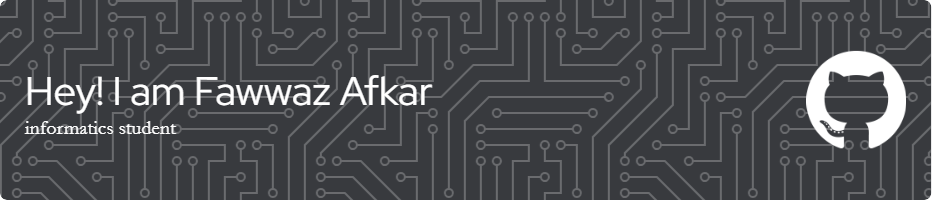

## About Me

I am a Informatics Student and software developer with a passion for creating innovative solutions.

- 🌱 Currently learning Mobile Dev
- 📫 How to reach me: [Email Here](mailto:fawazafkarr@gmail.com)

## Connect with Me

## Stats

<!---
FawwazAfkar/FawwazAfkar is a ✨ special ✨ repository because its `README.md` (this file) appears on your GitHub profile.
You can click the Preview link to take a look at your changes.
--->
